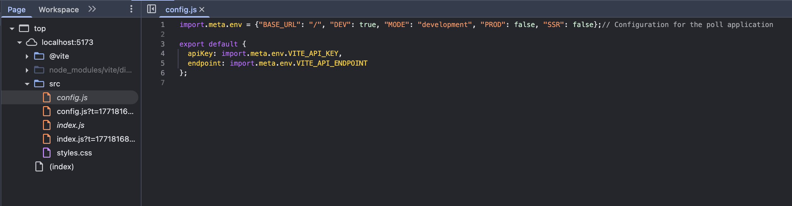

## Vulnerability fixed

This is a hardcoded secret. 

## Where was it?

It is in config.js, lines three and four. 

## Why is it dangerous?

The keys that are in config.js grant access to a service, account, or system. An attacker can use those credentials to get into other systems or use the sensitive data. 

## How did you fix it?

I created a .env file, stored the secrets in there, then put the file into gitignore so Git doesn't track it. It's secure because the actual secrets do not appear in the source files. 

## Screenshots (optional)

## Checklist

- [ ] Tested the fix locally with `npm run dev`
- [ ] Commit message clearly describes the security fix
